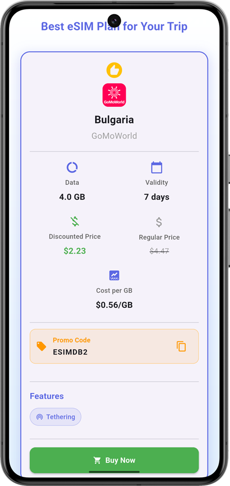
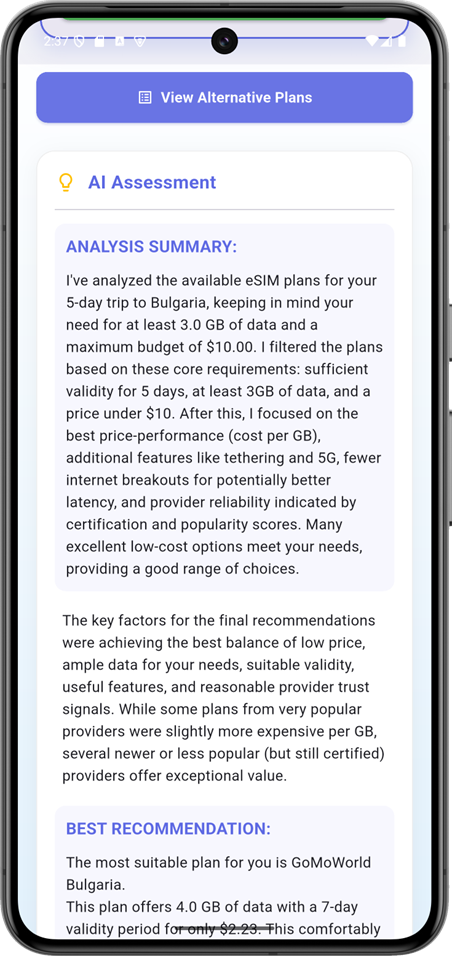

# eSIM Recommender App

An AI-powered Flutter application that provides eSIM plan recommendations for international travel.

## Screenshots

<table align="center">
  <tr>
    <td align="center"></td>
    <td align="center"></td>
    <td align="center"></td>
  </tr>
  <tr >
    <td align="center"></td>
    <td align="center"></td>
    <td align="center"></td>
  </tr>
</table>

## About the Project

eSIM Recommender finds the most suitable eSIM (electronic SIM) plans for users by collecting information such as their travel destination, duration of stay, and data needs. The application uses artificial intelligence to analyze current eSIM plans and offers personalized, cost-effective recommendations to the user.

## Key Features

*   Personalized eSIM recommendations using artificial intelligence
*   Country selection via an interactive map
*   Detailed travel information form
*   Price and feature comparison for recommended plans

## Technology Stack

*   **Framework:** Flutter
*   **Backend and AI:** Firebase (Firebase Vertex AI for Gemini)
*   **Data Collection:** Apify
*   **Map:** flutter_map

## Project Setup

Follow the steps below to run the project on your local machine.

### Requirements
*   [Flutter SDK](https://docs.flutter.dev/get-started/install)
*   [Firebase](https://firebase.google.com/) account
*   [Apify](https://apify.com/) account

### Installation Steps

1.  **Clone the Project:**
    ```sh
    git clone https://github.com/muhammetakkurtt/esim-recommender-app.git
    cd esim-recommender-app
    ```

2.  **Environment Variables:**
    Create a file named `.env` in the project's root directory and fill it with the content specified below using your own API keys. You can obtain these keys from the dashboards of the respective services (Firebase, Apify).

    ```
    # Firebase configuration
    FIREBASE_ANDROID_API_KEY=your_firebase_android_api_key
    FIREBASE_ANDROID_APP_ID=your_firebase_android_app_id
    FIREBASE_IOS_API_KEY=your_firebase_ios_api_key
    FIREBASE_IOS_APP_ID=your_firebase_ios_app_id
    FIREBASE_MESSAGING_SENDER_ID=your_firebase_messaging_sender_id
    FIREBASE_PROJECT_ID=your_firebase_project_id
    FIREBASE_STORAGE_BUCKET=your_firebase_storage_bucket
    FIREBASE_IOS_BUNDLE_ID=your_firebase_ios_bundle_id

    # Apify API
    APIFY_API_KEY=your_apify_api_key
    ```

3.  **Install Dependencies:**
    ```sh
    flutter pub get
    ```

4.  **Run the Application:**
    ```sh
    flutter run
    ``` 